# 🛒 Retail Analytics Dashboard  
### **RFM Segmentation | KMeans Clustering | CLV Prediction | Apriori Market Basket | Profit Analysis**

This project is a complete **Retail Analytics System** built using Python, Gradio, and Machine Learning models.  
It provides a full end-to-end analytical dashboard for customer insights, product patterns, and profit trends.

---

## 🚀 Live Demo (HuggingFace Space)

🔗 **Demo Link:**  
👉 _Add your HuggingFace link here_  
`https://huggingface.co/spaces/NauRaa/Retail_Analytics_Dashboard`

---

## 📸 Dashboard Preview
| Main Dashboard | RFM + KMeans | Profit Analysis | Outliers / correlation
|----------------------|------------------|----------------|------------------------------|
| 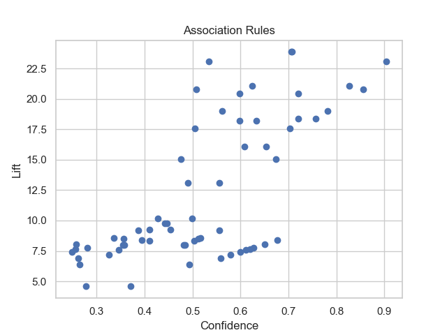 | 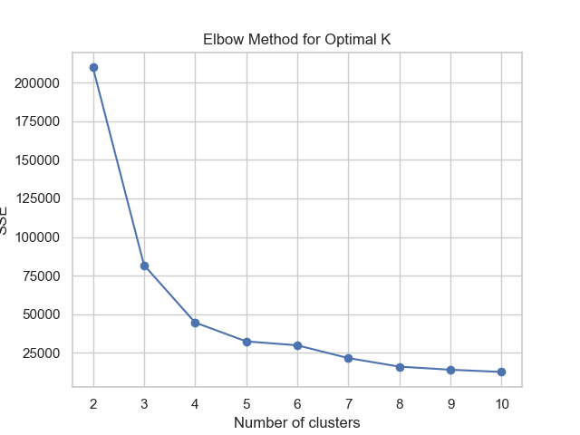   | 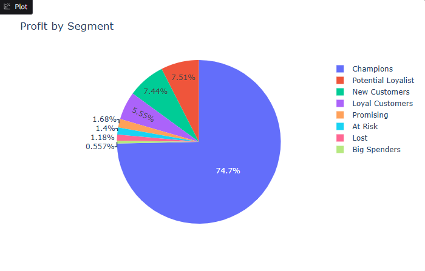     | 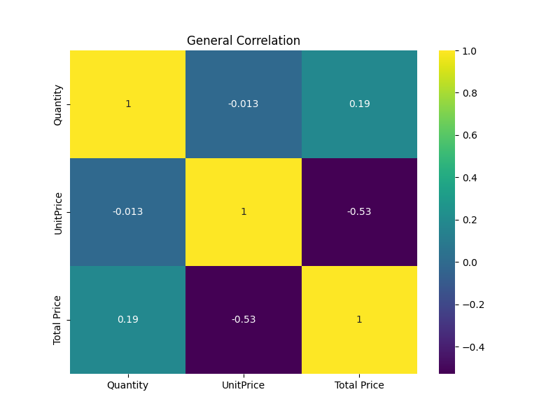 |
| 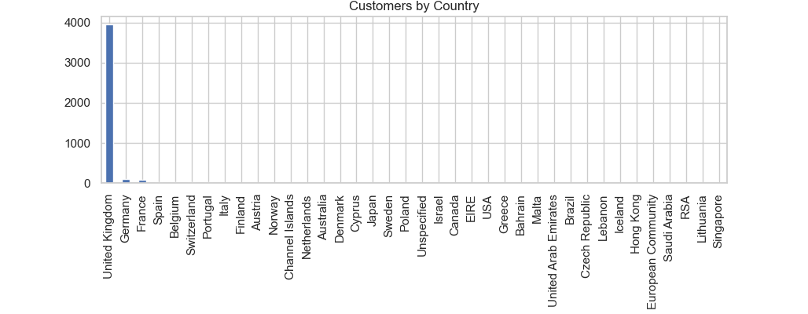    | 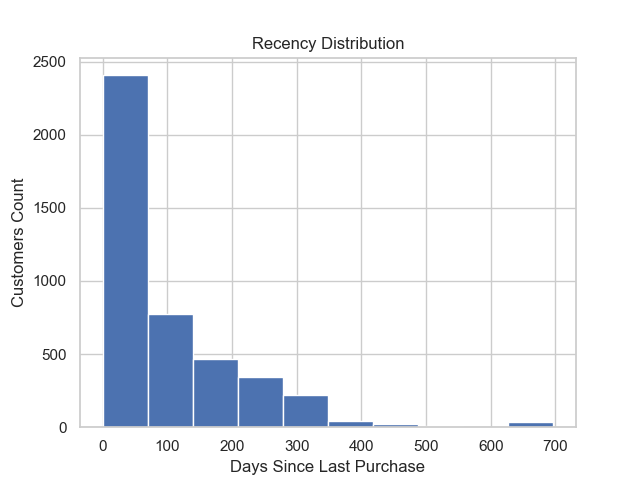   | 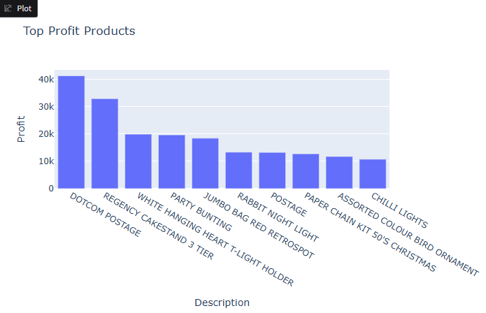     | 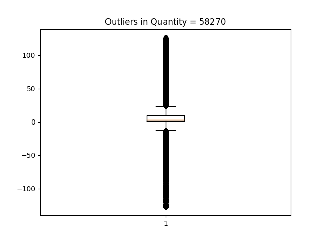   |
| 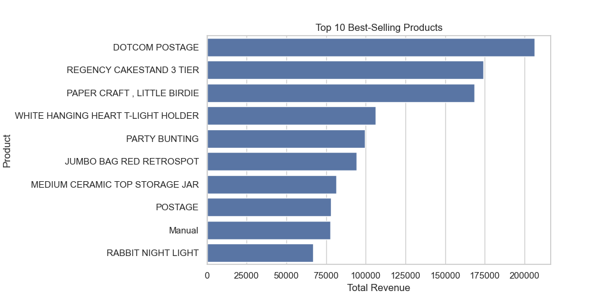 | 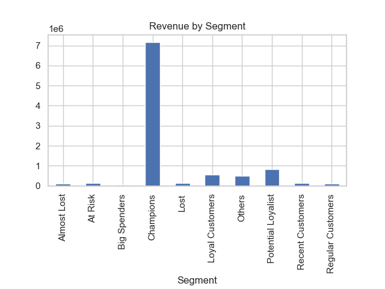 |                |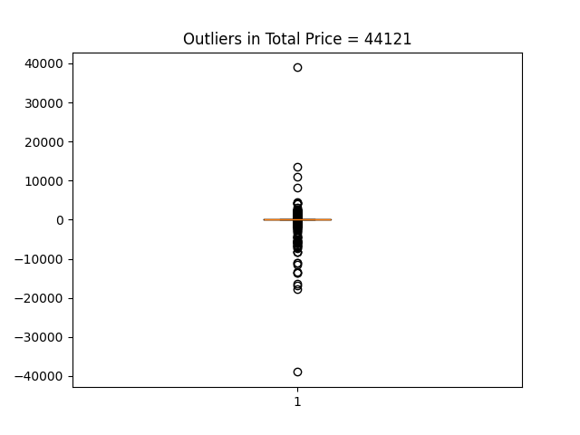  |
| 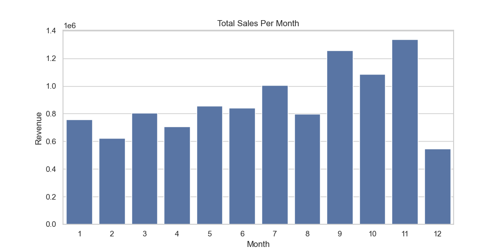 | 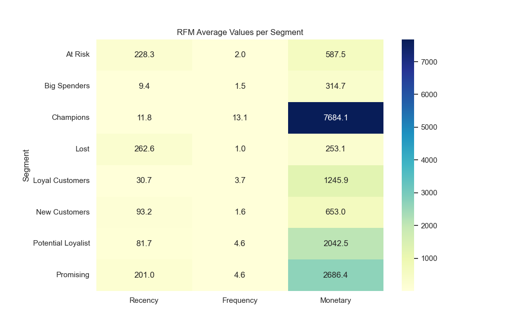     |                |                              |
| 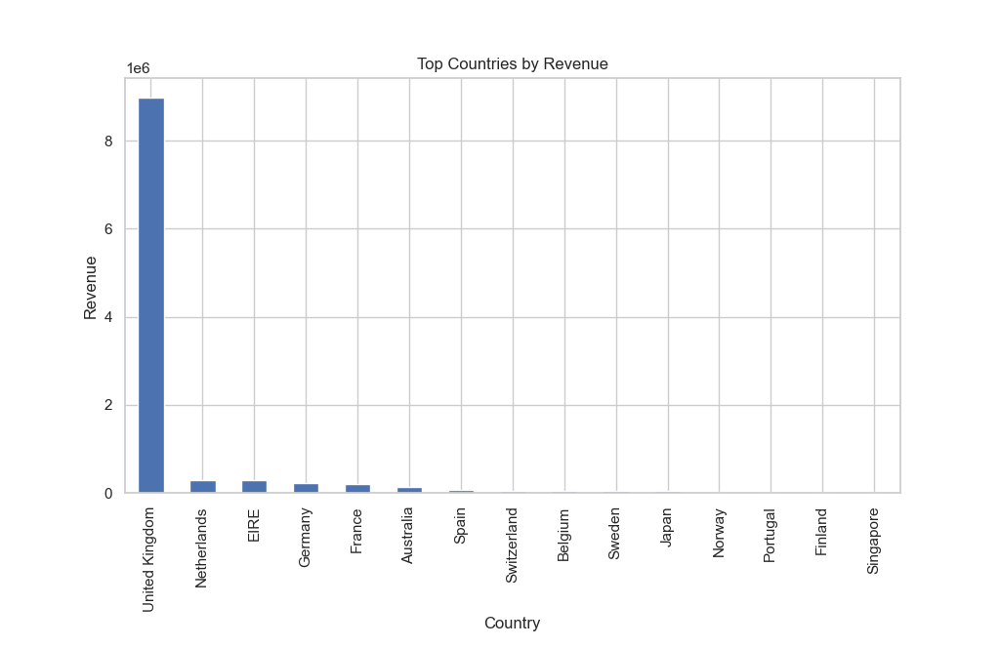  | 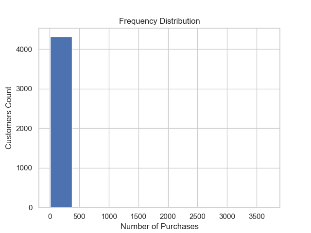    |                |                              |
|                      | 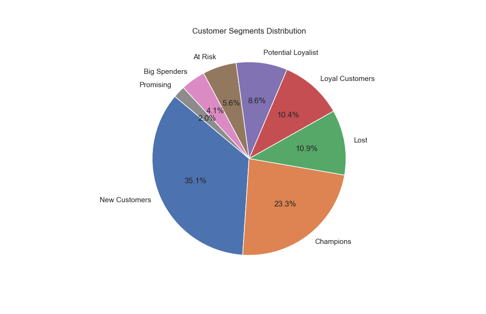 | 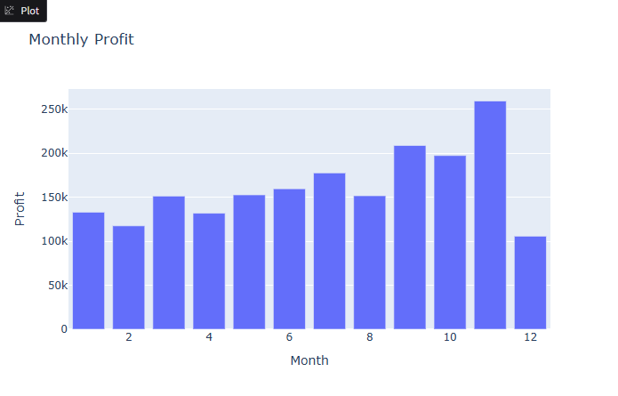     |                              |
|                      |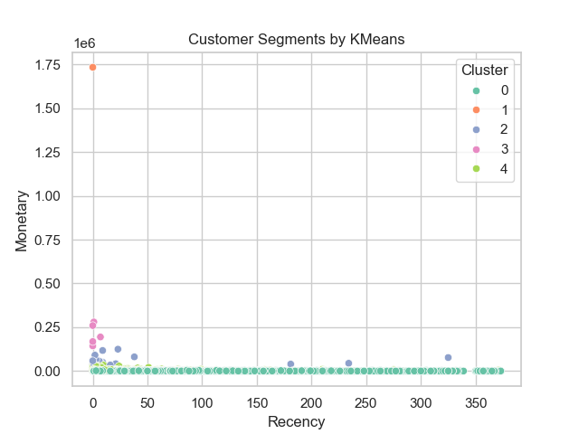|               |                              |


---

## 📦 Project Features

### ✅ **1. RFM Segmentation**
- Recency, Frequency, Monetary score calculation  
- Segments saved as CSV  
- Visualization:
  - RFM heatmap  
  - Segment distribution  
  - Top/Bottom products  

---

### ✅ **2. KMeans Clustering**
- KMeans trained on RFM values  
- Predict customer cluster  
- Visual interpretation in dashboard  

---

### ✅ **3. CLV Prediction**
- Predict **Customer Lifetime Value** using ML regression model  
- Uses (`Recency`, `Frequency`, `Monetary`)  
- Integrated inside the Gradio tab  

---

### ✅ **4. Apriori Market Basket Analysis**
- Association Rules generated using Apriori  
- Antecedents → Consequents  
- Dashboard gives product recommendations based on:
  - Customer purchase history  
  - Market basket patterns  
- Fallback: Top products if no rules exist  

---

### ✅ **5. Profit Analysis (New Addition)**
Even if the dataset does NOT contain real cost, the system supports:
- Fixed margin profit (default = 20%)  
- OR real cost if available  

Visualizations:
- Monthly Profit  
- Profit per Product  
- Profit per Customer Segment  

---

### ✅ **6. Sales Trends**
- Weekly sales  
- Monthly sales  
- Interactive line charts  

---

### ✅ **7. Interactive Dashboard (Gradio UI)**
Organized into tabs:
- **RFM + KMeans**
- **Sales Trends**
- **Profit Analysis**
- **CLV Prediction**
- **Basket Analysis**

---

## 📁 Dataset Used

📌 **Main Files**
- `new_Retail.csv` — Original retail data  
- `rfm_segments.csv` — Processed RFM dataset  
- `basket_rules.csv` — Apriori output  
- `kmeans_rfm_pipeline.pkl` — KMeans model  
- `clv_pipeline.pkl` — CLV model  

---

## 🧠 Machine Learning Models

### 🔹 KMeans Pipeline
```text
RobustScaler  → KMeans (k = chosen via elbow)
````

### 🔹 CLV Regression Pipeline

```text
RobustScaler  → RandomForestRegressor (tuned)
```

### 🔹 Apriori Parameters

```
min_support = 0.01  
min_confidence = 0.2  
min_lift = 1.2  
```

---

## 🏗️ Project Structure

```
Retail-Analytics/
│
├── app.py                     # Gradio Dashboard
├── rfm_segments.csv           # RFM processed data
├── new_Retail.csv             # Main dataset
├── basket_rules.csv           # Apriori rules
├── kmeans_rfm_pipeline.pkl    # Saved KMeans model
├── clv_pipeline.pkl           # Saved CLV model
│
├── images                    

└── README.md
```

---

## ▶️ How to Run Locally

### 1. Install Dependencies

```bash
pip install -r requirements.txt
```

### 2. Run the App

```bash
python app.py
```

### 3. The dashboard will open on:

```
http://127.0.0.1:7860
```

---

## 🧪 Future Improvements

* Add forecasting (ARIMA / Prophet)
* Add churn prediction model
* Add NLP product clustering
* Automate data cleaning pipeline
* Deploy on AWS/GCP with CI/CD

---

## ❤️ Author

**NauRaa**
*Data Scientist — ML | Analytics | Retail Intelligence*
